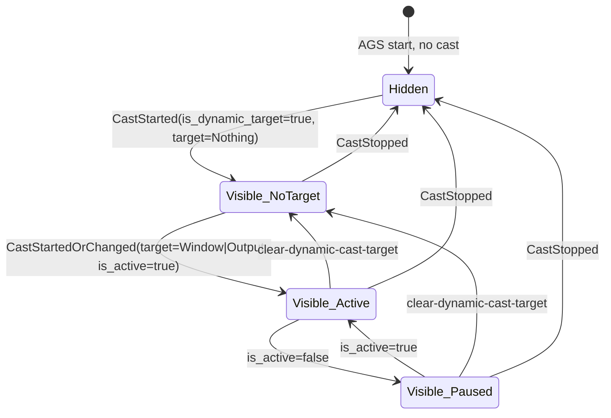

# feat: Add Niri Cast Tab to AGS Sidebar

## Overview

Add a sidebar tab — visible only under niri, only when a dynamic-cast-target screencast is live — that acts as a single-click operator console for retargeting the cast (window / monitor / clear). Hyprland keeps its existing `ScreenSharePicker` panel unchanged. The two surfaces share no runtime code.

## Problem Statement / Motivation

Niri's portal duties are delegated to `xdg-desktop-portal-gnome`, which has no custom-picker hook (XDPH's spawned-binary `[SELECTION]` protocol does not exist on niri). The hyprland picker we already built therefore can't be ported. But niri offers something hyprland does not: a **dynamic cast target** that can be re-pointed mid-stream via IPC — the consumer (Chrome / OBS / Zoom) keeps the same pipewire stream while we silently swap the source. This turns the architectural gap into a feature: the user picks "niri Dynamic Cast Target" once in the GNOME dialog, then uses the sidebar to swap what's shared without renegotiating with the browser.

Rejected alternatives (covered in the brainstorm): disable picker under niri (loses the niri-native feature); write a custom portal backend (far larger project, breaks the standard portal flow).

## Proposed Solution

Three components:

1. **`niri_cast` Python helper** (`dot_local/bin/executable_niri_cast`) — speaks the niri IPC protocol over `$NIRI_SOCKET`. Subcommands for one-shot queries/actions plus a long-lived `event-stream` mode that emits NDJSON to stdout.
2. **Cast tab UI** (`dot_config/ags/widget/cast/CastTab.tsx` + `cast-state.ts`) — gated by `activeTab === "cast"`, mirrors the structural pattern of `WezTermTab.tsx`. Reuses the `PreviewCard` visual from `ScreenSharePicker.tsx:34-88` for monitor thumbnails and the polling shape from `screenshare-state.ts:60-122` for `grim` invocations.
3. **Conditional tab visibility infrastructure** (`dot_config/ags/widget/sidebar-state.ts`, `Sidebar.tsx`) — a new `visibleTabs` reactive, with a per-tab `visible?: () => boolean | Accessor<boolean>` predicate. Tabs without a predicate are always visible (preserves hyprland behavior).

## Technical Approach

### Architecture

```
                   $NIRI_SOCKET
                          │
                          ▼
        ┌──────────────────────────────────┐
        │  niri_cast event-stream          │
        │  (long-lived python process)     │
        │  • opens socket, sends           │
        │    {"action":"EventStream"}      │
        │  • parses NDJSON Events          │
        │  • emits debounced state JSON    │
        │    on stdout                     │
        └──────────────────────────────────┘
                          │ NDJSON state snapshots
                          ▼
        ┌──────────────────────────────────┐
        │  cast-state.ts (AGS)             │
        │  • subscribeProcess('niri_cast') │
        │  • createState<CastState>()      │
        │  • visibleTabs predicate:        │
        │    state.casts.some(             │
        │      c=>c.is_dynamic_target)     │
        └──────────────────────────────────┘
                          │ reactive
                          ▼
        ┌──────────────────────────────────┐
        │  CastTab.tsx                     │
        │  • Currently-cast row            │
        │  • Screen thumbnails             │
        │  • Window rows                   │
        │  • Pick / Clear buttons          │
        │  Click → execAsync(niri_cast set-window/monitor/clear/pick)
        └──────────────────────────────────┘
```

### Cast Lifecycle (state diagram)



### Two-Socket Pattern

Niri stops reading further requests on a socket once `EventStream` is sent. Therefore:
- **Socket A (long-lived):** `niri_cast event-stream` opens it, writes `"EventStream"`, reads NDJSON forever.
- **Socket B (per-request):** every action subcommand (`set-window`, `set-monitor`, `clear`, `pick`, `windows`, `outputs`) opens, sends one Request, reads one Reply, closes.

### Implementation Phases

#### Phase 1 — Niri IPC helper + compositor detection (no UI)

Goal: prove the IPC plumbing in isolation; ship a CLI that's useful on its own.

Files:
- `dot_local/bin/executable_niri_cast` — Python 3.10+, `JParser`, subcommands listed below
- `dot_config/ags/lib/compositor.ts` — exports `isNiri()`, `isHyprland()` from env vars at module load (memoized)

`niri_cast` subcommands:

```python
# dot_local/bin/executable_niri_cast (sketch)
parser = JParser(description="Niri IPC bridge for cast tab")
sub = parser.add_subparsers(dest="cmd", required=True)

sub.add_parser("event-stream", help="Stream NDJSON state snapshots to stdout")
sub.add_parser("snapshot", help="One-shot full state snapshot to stdout")
sub.add_parser("windows", help="List windows as JSON")
sub.add_parser("outputs", help="List outputs as JSON")
sub.add_parser("casts", help="List casts as JSON")

p_setw = sub.add_parser("set-window", help="Retarget dynamic cast to a window")
p_setw.add_argument("window_id", type=int, nargs="?", help="Window id (focused if omitted)")

p_setm = sub.add_parser("set-monitor", help="Retarget dynamic cast to an output")
p_setm.add_argument("output", nargs="?", help="Output name (focused if omitted)")

sub.add_parser("clear", help="Clear dynamic cast target")
sub.add_parser("pick", help="Pick a window via niri overlay; print id+title")
```

Key behaviors:
- All actions write JSON Request to socket B and assert `Reply == {"Ok": ...}`. Non-Ok exits 1 with stderr message.
- `event-stream` debounces output by 100ms (coalesce burst events from niri).
- Each NDJSON state snapshot has shape:
  ```json
  {
    "casts": [{"id": 7, "is_dynamic_target": true, "is_active": true,
               "target": {"kind": "Window", "window_id": 42}}],
    "windows": [{"id": 42, "app_id": "firefox", "title": "GitHub — niri",
                 "workspace_id": 3, "is_focused": false,
                 "focus_timestamp": 1234567}],
    "workspaces": [{"id": 3, "idx": 2, "name": null, "output": "DP-1"}],
    "outputs": [{"name": "DP-1", "make": "...", "logical": {...}}]
  }
  ```
- Reconnect with exponential backoff (1s → 2s → 5s, cap 30s) when socket EOFs. Emit a sentinel `{"_disconnected": true}` snapshot during the gap so AGS can show a "reconnecting" banner.

Register in `j` launcher: append `"niri_cast:Niri IPC bridge for cast tab"` to `SCRIPTS` array in `dot_local/bin/executable_j`.

Acceptance Phase 1:
- [ ] `niri_cast snapshot | jq .casts` returns valid JSON when no cast active *(needs live niri session)*
- [ ] `niri_cast event-stream` keeps emitting on cast start/stop *(needs live niri session)*
- [ ] `niri_cast pick` returns `{"id": N, "title": "..."}` or `null` on cancel *(needs live niri session)*
- [ ] `niri_cast set-window 42` retargets a live cast (manual test with Chrome) *(needs live niri session)*
- [x] `niri_cast` runs cleanly without `$NIRI_SOCKET` (clean error + exit 1)
- [x] `niri_cast --_j_meta` outputs valid JSON; entry added to `j` SCRIPTS array
- [ ] Reconnects after `niri msg action quit` / `systemctl --user restart niri` *(needs live niri session)*

#### Phase 2 — Conditional tab visibility infrastructure

Goal: `visibleTabs` reactive plumbing in the sidebar, with a contract that hyprland tabs are unaffected.

Files modified:
- `dot_config/ags/widget/sidebar-state.ts` — add `Tab.visible?: Accessor<boolean>` field; add `visibleTabs` derived; redirect `switchTab` to ignore hidden ids; `readPersistedTab()` keeps stored value even if currently hidden (re-renders when it becomes visible)
- `dot_config/ags/widget/Sidebar.tsx` — `TabBar` iterates `visibleTabs` instead of `TABS`; render container picks active tab id from `visibleTabs` for fallback rendering only

Hyprland inertness contract (must hold):
- [x] A tab without `visible` predicate is always in `visibleTabs` (filter clause: `!t.visible || t.visible()`)
- [x] Under hyprland, no tab registers a predicate, so `visibleTabs.length === TABS.length` (no predicates registered until Phase 3)
- [ ] Manual smoke test on user's running AGS confirms hyprland sidebar tabs render identically

Active-tab persistence rules:
- [x] Persist user's last-active tab id verbatim (`activeTab` is never overwritten by fallback logic)
- [x] Render uses `activeTab ∈ visibleTabs ? activeTab : visibleTabs[0]` (implemented as `renderedTab` derived)
- [x] When the previously-active tab re-appears, it auto-becomes the rendered tab (reactive `renderedTab` re-evaluates on `visibleTabs` change)

Acceptance Phase 2:
- [x] `ags bundle app.ts ... --gtk 4` succeeds (esbuild compiles all changes cleanly)
- [ ] AGS restarted: hyprland tabs (notifications/clipboard/files/wezterm) still render and switch normally *(needs user verification)*
- [ ] Persisted `activeTab="cast"` (no Cast tab yet) falls back to notifications without overwriting persisted value *(needs Phase 3 to test)*

#### Phase 3 — Cast tab UI

Files:
- `dot_config/ags/widget/cast/cast-state.ts`
- `dot_config/ags/widget/cast/CastTab.tsx`
- `dot_config/ags/widget/cast/iconForApp.ts` — `Gtk.IconTheme.get_for_display(...).has_icon(app_id)` lookup with `application-x-executable` fallback

Wire into `sidebar-state.ts`:

```typescript
// dot_config/ags/widget/sidebar-state.ts (after change)
import { isNiri } from "../lib/compositor"
import { castVisible } from "./cast/cast-state"

export const TABS: Tab[] = [
  { id: "notifications", icon: "..." },
  { id: "clipboard",     icon: "..." },
  { id: "files",         icon: "..." },
  { id: "wezterm",       icon: "..." },
  ...(isNiri()
    ? [{ id: "cast" as TabId, icon: "...", visible: castVisible }]
    : []),
]
```

UX layout (mirrors brainstorm sketch):

```
Currently casting
  [icon] Firefox — "GitHub — niri/niri"          [Stop casting]
  ── paused (no consumer connected) ──              (when is_active=false)

Switch to:
  Screens:  [DP-1 grim thumb]  [HDMI-A-1 grim thumb]
  Windows (sorted by focus_timestamp DESC):
    [icon] Firefox — GitHub — niri/niri (ws 2)
    [icon] nvim    — cast-state.ts      (ws 1)  ← currently-cast row
    [icon] Discord — #general            (ws 3)
                                          [Pick visually] [Clear target]
```

Behavior contract:
- **Visibility predicate:** tab visible iff `state.casts.some(c => c.is_dynamic_target)`. (Decision from SpecFlow #1.) Stays visible when paused; stays visible when target is `Nothing`.
- **Paused badge:** when *any* `is_dynamic_target` cast has `is_active=false`, show subtle inline label "paused — no consumer". Don't hide the tab.
- **Multi-consumer dedupe:** "Currently casting" row reflects `target` (one row), not consumer count. "Stop casting" calls `clear-dynamic-cast-target` (target-scoped — affects all consumers).
- **Click switching:** instant, no confirmation. Last-write-wins; no debounce.
- **Currently-cast row:** rendered with `@accent_bg_color` border, `disabled` state, no click handler.
- **Stale-window clicks:** `set-window` failure → silent log to stderr (captured by AGS log), no toast.
- **"Pick visually":** disable button → `App.toggle_window("sidebar")` (close) → spawn `niri_cast pick` → on result, call `set-window` → reopen sidebar. Esc cancels (helper returns `null`); silent re-enable.
- **Window sort:** `focus_timestamp` DESC (most recent first). Workspace label: `workspace.name || "ws " + workspace.idx`. No monitor prefix.
- **Empty windows:** show literal "No windows open" copy. Screens row + Pick / Clear buttons remain.
- **Disconnected:** inline banner "Reconnecting to niri…" while `_disconnected` sentinel is the latest message.

Subscription vs render lifecycle (SpecFlow #18 — critical):
- Event-stream subprocess starts at module load when `isNiri()`, runs forever (visibility detection itself depends on it).
- `grim` thumbnail polling for the *currently-cast* output runs only when the tab is visible AND `activeTab === "cast"`. 3s interval, cancelled via `GLib.Source.remove`.
- Non-cast output thumbnails: capture once on tab-content mount, cache. No periodic refresh.
- Pause thumbnails completely when the AGS sidebar window itself is hidden (use the existing `popupVisible` signal if it exists, else hook `Sidebar`'s onShow/onHide).

### Compositor Detection Edge Cases

```typescript
// lib/compositor.ts
const niriSock  = GLib.getenv("NIRI_SOCKET")
const hyprSig   = GLib.getenv("HYPRLAND_INSTANCE_SIGNATURE")
export const isNiri      = () => Boolean(niriSock)
export const isHyprland  = () => !niriSock && Boolean(hyprSig)  // niri wins ties
```

Both unset: `isNiri() === false`, `isHyprland() === false`. Cast tab not registered, hyprland panel still mounts but `AstalHyprland.get_default()` will fail loudly — log a one-line warning and continue (don't crash AGS).

## Acceptance Criteria

### Functional Requirements

- [ ] Cast tab appears in sidebar under niri only when at least one `is_dynamic_target=true` cast exists
- [ ] Tab disappears within ~200ms of cast stop (debounce window)
- [ ] Currently-cast target rendered prominently with app icon + title; "Stop casting" button works
- [ ] Clicking a window row retargets the cast within ~100ms (perceived); no confirmation dialog
- [ ] Clicking a screen thumbnail retargets to that monitor
- [ ] "Pick visually" closes sidebar, invokes niri's overlay, retargets to picked window, reopens sidebar; Esc cancels cleanly
- [ ] "Clear target" sets target to `Nothing`; tab stays visible (cast still exists)
- [ ] Paused-consumer state shows "paused" badge; tab does not disappear
- [ ] Window list sorted most-recently-focused first; workspace badge shows name or `ws <idx>`
- [ ] App icons resolve via GTK icon theme; fallback to `application-x-executable` when unknown
- [ ] Non-dynamic casts (`is_dynamic_target=false`) are ignored entirely
- [ ] Multiple consumers of same target: rendered as a single row; "Stop casting" affects all
- [ ] Niri socket EOF triggers exponential backoff reconnect with "Reconnecting…" banner

### Non-Functional Requirements

- [ ] Hyprland sidebar tabs render identically to before (`visibleTabs.length === TABS.length` under hyprland)
- [ ] Hyprland `ScreenSharePicker.tsx` and `screenshare-state.ts` unchanged
- [ ] No new dependency on DBus monitoring (event-stream alone is sufficient for visibility)
- [ ] Event-stream subprocess survives `systemctl --user restart niri`
- [ ] Errors logged to AGS stderr (`~/.local/state/ags/ags.log`); no toasts during a live cast
- [ ] Compositor detection adds zero startup cost on hyprland (no `AstalNiri` import on hyprland code paths)
- [ ] Persisted `activeTab="cast"` does not throw on AGS startup with no cast (renders fallback, value preserved)

### Quality Gates

- [ ] Manual smoke test on niri: start Chrome screenshare with "niri Dynamic Cast Target", retarget to 3 different windows + 2 monitors, verify Chrome's preview updates each time
- [ ] Manual smoke test on hyprland: existing screenshare picker still works; sidebar tabs unchanged
- [ ] `niri_cast --_j_meta` passes JParser introspection; appears in `j` launcher
- [ ] Lint passes (`tsc --noEmit` in `dot_config/ags/`)

## Success Metrics

- Mid-stream retarget latency < 200ms perceived (click → consumer-visible swap)
- Tab visibility tracks cast state with < 200ms lag
- Zero regressions to hyprland sidebar (manual smoke test)
- Niri IPC failures don't crash AGS (verified by killing/restarting niri during a session)

## Dependencies & Risks

**Dependencies:**
- niri ≥ 25.11.0 (for stable `set-dynamic-cast-*` actions and `Cast` event variants — confirmed against `niri-ipc/src/lib.rs` on `main`)
- `xdg-desktop-portal-gnome` (already required for niri screensharing, not a new dep)
- `grim` (already used by `screenshare-state.ts`)
- AGS v3 + gnim (current setup)

**Risks:**
- *Niri IPC schema drift:* `niri-ipc` is CalVer; field/variant additions are common and unannounced. Mitigation: defensive JSON parsing in the Python helper (use `.get()` with defaults, ignore unknown event variants).
- *Two sockets confusion:* developer might forget that `EventStream` blocks further requests on the same socket. Mitigation: helper enforces this — `event-stream` subcommand never sends actions; action subcommands always open fresh sockets.
- *Conditional-tab regression on hyprland:* the shared `sidebar-state.ts` change is the highest-risk part. Mitigation: contract documented in Phase 2; smoke test under both compositors.
- *Race on tab disappearance mid-click:* user clicks a row, cast ends, `activeTab` falls back, click handler is gone. Acceptable behavior — IPC call is fire-and-forget; no retry, no UI feedback expected for a vanished surface (SpecFlow #16).

## Out of Scope

- Hyprland gets a sidebar-tab sibling for symmetry (deferred — brainstorm Q4)
- Region capture under niri (dynamic cast target only supports window/monitor)
- Window thumbnail captures under niri (no IPC for window geometry capture, app icon + title only)
- Auto-opening the sidebar when a cast starts (brainstorm Q1 decision: no automatic discoverability)
- Notifications / DBus monitoring of portal (not needed — event stream is sufficient)
- Keyboard navigation through cast rows (basic Tab order only; arrow-key nav deferred)

## References & Research

### Internal References

- Brainstorm: `docs/brainstorms/2026-04-18-niri-cast-tab-brainstorm.md`
- Existing screenshare picker (DO NOT MODIFY): `dot_config/ags/widget/screenshare/ScreenSharePicker.tsx`
- Existing screenshare state (reuse polling shape): `dot_config/ags/widget/screenshare/screenshare-state.ts:60-122`
- Pattern to mirror (Python helper + tab content): `dot_config/ags/widget/WezTermTab.tsx`
- Sidebar tab registry (modify): `dot_config/ags/widget/sidebar-state.ts:13-42`
- Sidebar TabBar (modify): `dot_config/ags/widget/Sidebar.tsx:104-116`
- Compositor helper location: `dot_config/ags/lib/monitor.tsx` (sibling: new `lib/compositor.ts`)
- Script conventions: `CLAUDE.md` § Creating Scripts, `j` launcher integration
- AGS conventions: `dot_config/ags/CLAUDE.md`, `dot_config/ags/.claude/skills/`
- ScreenShare protocol learnings: `docs/screenshare-picker.md`

### External References

- Niri IPC schema (canonical): https://github.com/YaLTeR/niri/blob/main/niri-ipc/src/lib.rs
- Niri IPC wiki: https://github.com/YaLTeR/niri/wiki/IPC
- Niri Screencasting wiki (dynamic target section): https://github.com/YaLTeR/niri/wiki/Screencasting#dynamic-screencast-target
- niri-ipc crate (pin exactly to current niri version): https://crates.io/crates/niri-ipc

### Related Plans

- `docs/plans/2026-02-11-feat-sidebar-panel-foundation-plan.md` — sidebar foundation (shipped)
- `docs/plans/2026-02-12-feat-sidebar-tabbed-interface-plan.md` — tabbed sidebar (shipped)
- `docs/plans/2026-02-11-feat-notification-sidebar-history-plan.md` — first sidebar tab (shipped)
- `docs/plans/2026-02-12-feat-perplexity-chat-panel-plan.md` — separate panel pattern (shipped)
